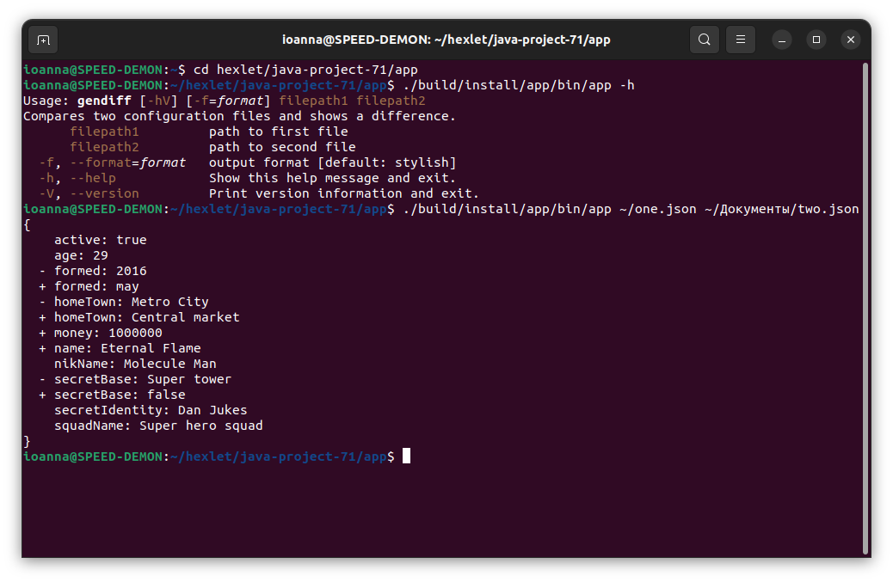
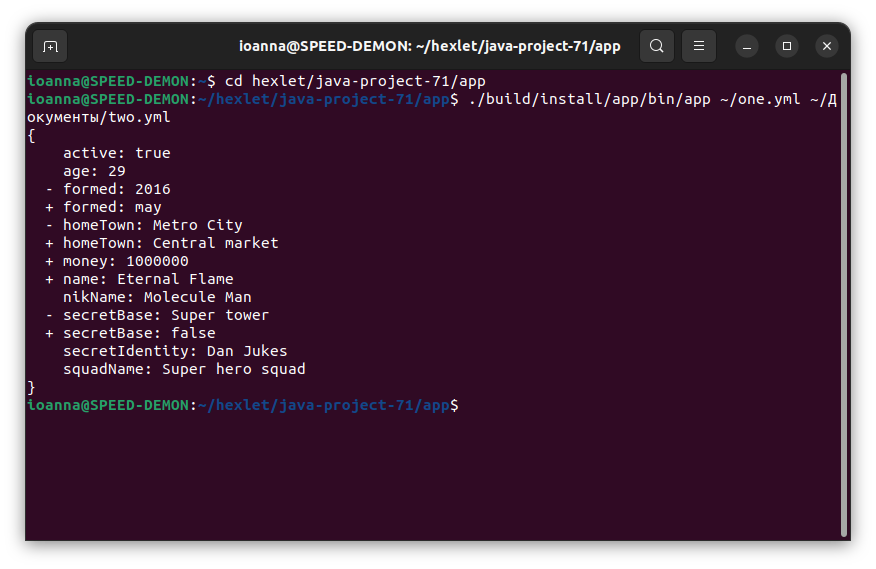
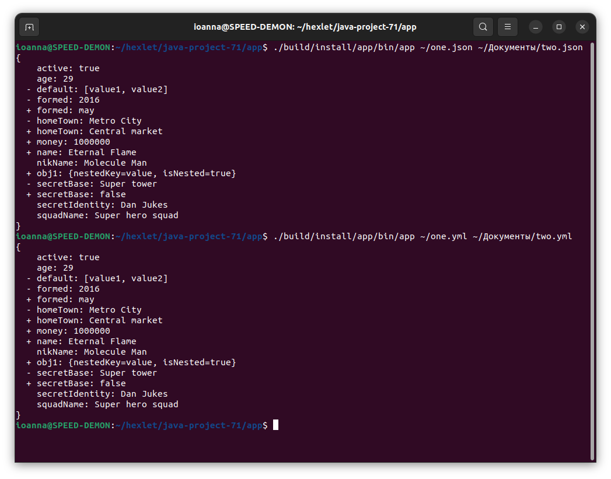
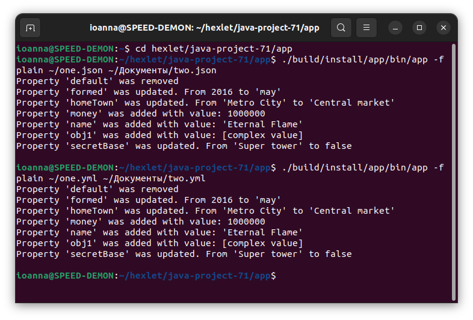
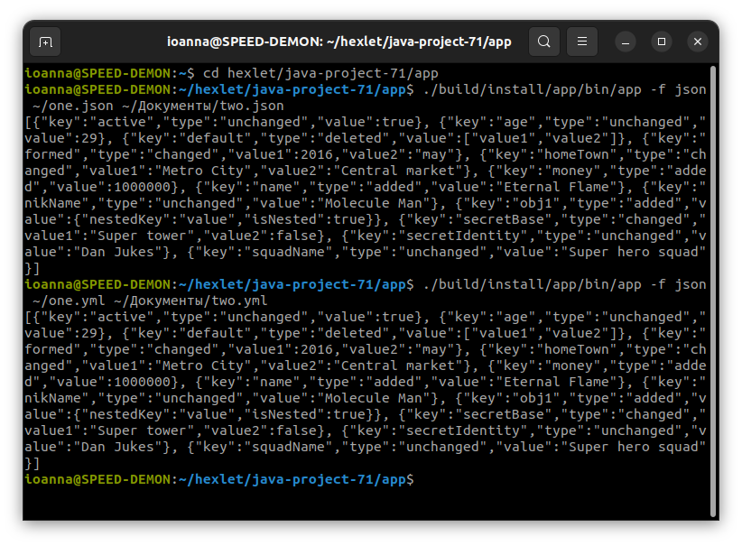

### Hexlet tests and linter status:
   

Сравнение файлов JSON: вывод в формате по-умолчанию (stylish)

Сравнение файлов YAML: вывод в формате по-умолчанию (stylish)

Сравнение файлов JSON и YAML со вложенными структурами: вывод в формате по-умолчанию (stylish)

Сравнение файлов JSON и YAML со вложенными структурами: вывод в формате plain

Сравнение файлов JSON и YAML со вложенными структурами: вывод в формате json

